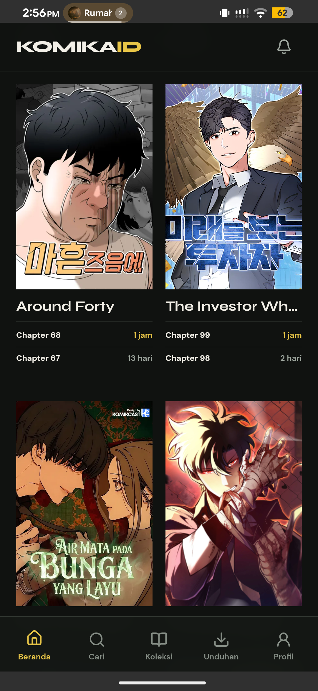
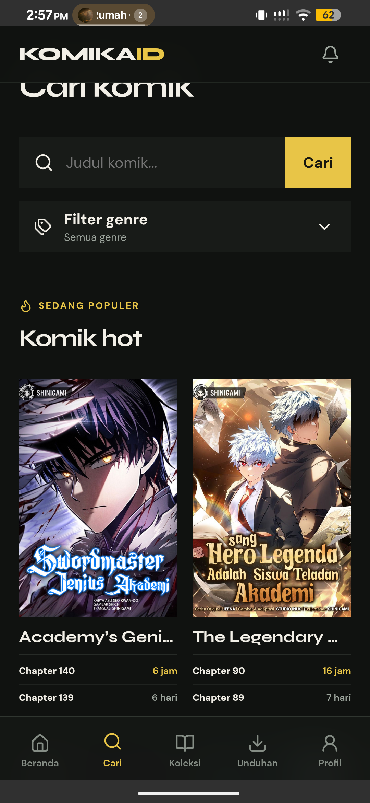
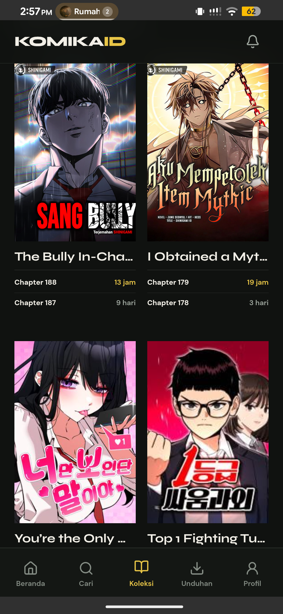
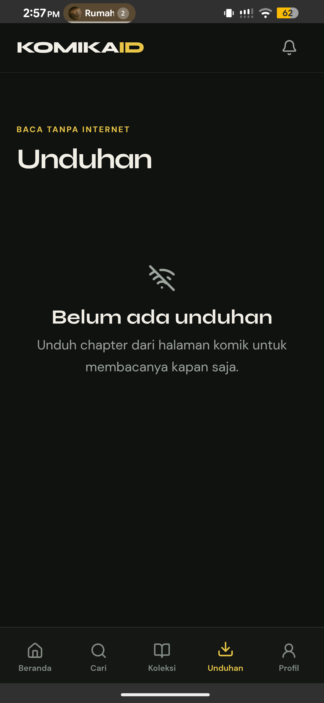
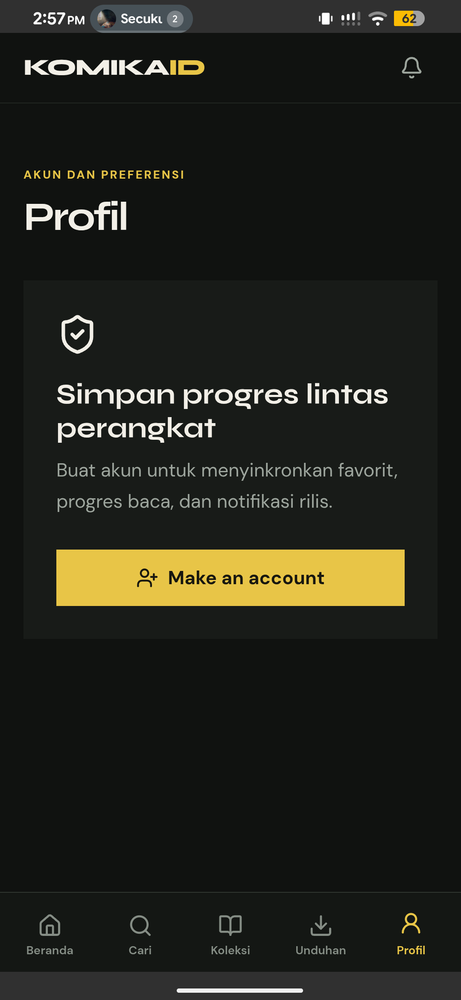
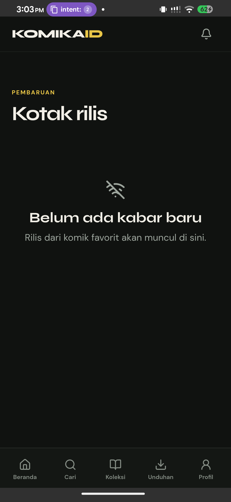

<div align="center">
  

  <h1>KomikaID</h1>

  <p>Baca komik Indonesia tanpa drama — offline-first, gratis, dan open source.</p>

  <p>
    <a href="https://react.dev/"></a>
    <a href="https://www.typescriptlang.org/"></a>
    <a href="https://capacitorjs.com/"></a>
    <a href="https://developer.android.com/"></a>
    <a href="./LICENSE"></a>
    
  </p>

  <p>
    <a href="https://github.com/WyvernCW/komikaid/releases/latest"><strong>Download APK</strong></a>
    &nbsp;·&nbsp;
    <a href="https://github.com/WyvernCW/komikaid/issues">Report Bug</a>
    &nbsp;·&nbsp;
    <a href="https://github.com/WyvernCW/komikaid/issues">Request Feature</a>
  </p>
</div>

---

> [!WARNING]
> **KomikaID nggak ada di Google Play Store dan nggak akan pernah dipublish ke sana.**
> Kalau kamu nemu aplikasi bernama KomikaID di Play Store atau sumber lain — **itu palsu, jangan diinstall.**
> Download resmi cuma ada di halaman [Releases](https://github.com/WyvernCW/komikaid/releases) di repo ini.
> Kalau suatu saat ada perubahan soal ini, pengumumannya bakal ada di sini duluan sebelum ke mana-mana.

---

## Table of Contents

- [Why KomikaID?](#why-komikaid)
- [Screenshots](#screenshots)
- [Features](#features)
- [Installation](#installation)
- [Build from Source](#build-from-source)
- [Architecture](#architecture)
- [Tech Stack](#tech-stack)
- [Platforms](#platforms)
- [Open Source](#open-source)
- [Contributing](#contributing)
- [License](#license)

---

## Why KomikaID?

Sebagian besar aplikasi baca komik punya masalah yang sama — loading lama, iklan nyebelin, atau langsung error kalau sinyal jelek. KomikaID dibangun dari awal buat ngatasin itu.

Data tersimpan lokal, jadi komik tetap bisa dibaca walau offline. Progress chapter tersimpan otomatis, jadi nggak perlu inget udah sampai mana. Dan karena ini open source, nggak ada yang disembunyiin — nggak ada iklan, nggak ada tracking, nggak ada versi premium.

---

## Screenshots

<div align="center">
  
  
  
</div>

<br>

<div align="center">
  
  
  
</div>

---

## Features

### Discover
- Browse rilis harian dan katalog komik dengan paginasi.
- Cari berdasarkan judul, filter genre dengan aturan include atau exclude.
- Dua chapter terbaru langsung keliatan di bawah tiap cover.
- Detail komik lengkap — deskripsi, tag, dan daftar chapter yang bisa dicari.

### Read
- Vertical reader yang smooth dengan page preloading.
- Loncat ke chapter manapun langsung dari dalam reader.
- Otomatis lanjut dari chapter dan halaman terakhir yang dibaca.
- Navigasi pakai browser history atau tombol back Android.
- Atur kecerahan reader, pindah chapter tanpa keluar dari reader.

### Offline
- Download chapter lengkap buat dibaca kapanpun tanpa internet.
- Unduhan yang putus bisa dilanjut — halaman yang udah kedownload nggak diulang dari awal.
- Chapter yang didownload tersimpan sampai kamu hapus sendiri.
- Cache otomatis buat katalog, detail, dan gambar — berguna banget kalau sinyal lagi jelek.

### Collection
- Komik yang udah dibaca otomatis masuk ke koleksi.
- Lacak favorit, riwayat, progress chapter, dan status download dalam satu tempat.
- Bisa langsung pakai tanpa akun, terus merge riwayat lokal setelah login.
- Sinkronisasi koleksi antar perangkat buat yang pakai akun.

### Notifications
- Follow komik tertentu buat dapet notif waktu chapter baru rilis.
- Push notification Android lewat OneSignal dan Firebase.
- Notifikasi langsung buka ke komik atau chapter yang relevan.
- Inbox notifikasi dalam aplikasi buat ngecek rilis terbaru.

---

## Installation

> Download selalu dari halaman **[Releases](https://github.com/WyvernCW/komikaid/releases)** — jangan dari sumber lain.

**Requirements:** Android 7.0 (API 24) ke atas.

1. Buka halaman [Releases](https://github.com/WyvernCW/komikaid/releases) dan download `komikaid.apk` dari release terbaru.
2. Buka **Pengaturan → Keamanan → Install unknown apps**, aktifkan buat browser atau file manager yang kamu pakai buat download.
3. Buka file `.apk`, tap **Install**, tunggu selesai.
4. Buka KomikaID dan mulai baca — login opsional, semua fitur baca bisa dipakai tanpa akun.

---

## Build from Source

### Requirements

- Node.js 20+
- Android Studio (untuk build Android)
- Java 17+

### Quick Start

```bash
git clone https://github.com/WyvernCW/komikaid.git
cd komikaid
npm install
npm run dev
```

### Android Build

```bash
npm run build
npx cap sync android
npx cap open android
```

Dari Android Studio, pakai **Build → Generate Signed Bundle / APK**. Atau lewat Gradle langsung:

```bash
cd android
./gradlew assembleRelease
```

APK hasil build bakal ada di `android/app/build/outputs/apk/release/`.

---

## Architecture

```
React application
    |
    +-- TanStack Query       Remote data dan cache lifecycle
    +-- Zustand              Transient UI state
    +-- IndexedDB / SQLite   Library, riwayat, progress, metadata
    +-- Capacitor Filesystem Halaman chapter yang didownload
    |
KomikaID API
    |
    +-- Runtime validation
    +-- Request timeout dan bounded retry
    +-- Stale-cache fallback
    +-- Rate limiting
    +-- Image proxy dan caching
    |
Shinigami content provider
```

Client cuma ngobrol sama API route KomikaID yang sudah dinormalisasi. Semua behavior upstream diisolasi di balik provider adapter — jadi validasi response, caching, security, dan perubahan provider ke depannya nggak bocor ke UI.

---

## Tech Stack

| Area | Technology |
|------|------------|
| Interface | React 19, TypeScript 6, Vite, React Router |
| Mobile | Capacitor 8, Android, iOS project |
| Data fetching | TanStack Query, Zod |
| State | Zustand |
| Offline storage | SQLite, IndexedDB, Capacitor Filesystem |
| Encryption | SQLCipher |
| Authentication | Clerk |
| Notifications | OneSignal, Firebase Cloud Messaging |
| Backend | Express, first-party provider adapter |
| Testing | Vitest, Playwright, ESLint |

---

## Platforms

| Platform | Status |
|----------|--------|
| Web / PWA | Supported |
| Android | Supported |
| iOS | Capacitor project tersedia; build final butuh macOS dan Apple Developer account |

---

## Open Source

KomikaID sepenuhnya open source di bawah lisensi MIT. Source code bebas buat dilihat, dipelajari, di-fork, atau dikontribusiin.

**Nggak ada versi berbayar. Nggak ada iklan. Nggak ada distribusi di luar GitHub.**

Proyek ini nggak akan pernah ada di Google Play Store. Kalau ketemu di sana, itu bukan dari pengembang asli — laporin aja sebagai aplikasi palsu. Semua pengumuman resmi, termasuk kalau ada perubahan kebijakan distribusi, bakal dipost di repositori ini duluan sebelum ke mana-mana.

---

## Contributing

Kontribusi dalam bentuk apapun disambut — bug report, saran fitur, perbaikan docs, atau pull request langsung.

```bash
# Fork → clone → buat branch
git checkout -b feat/nama-fitur

# Commit dengan pesan yang jelas
git commit -m "feat: tambah sesuatu yang berguna"

# Push dan buka Pull Request
git push origin feat/nama-fitur
```

Buat perubahan besar atau fitur baru, buka issue dulu biar bisa didiskusiin sebelum mulai ngoding. Lebih hemat waktu buat semua pihak.

---

## License

Distributed under the MIT License. See [LICENSE](./LICENSE) for more information.

---

<div align="center">
  <sub>Built for readers who shouldn't have to choose between speed, reliability, and a clean reading experience.</sub>
</div>